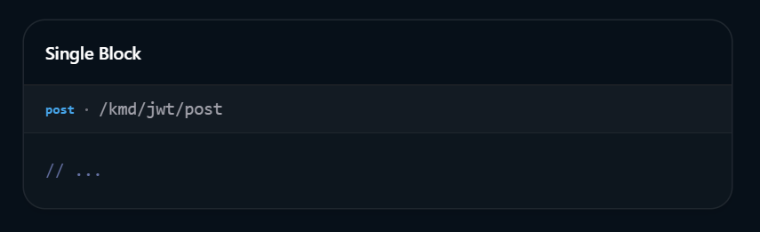
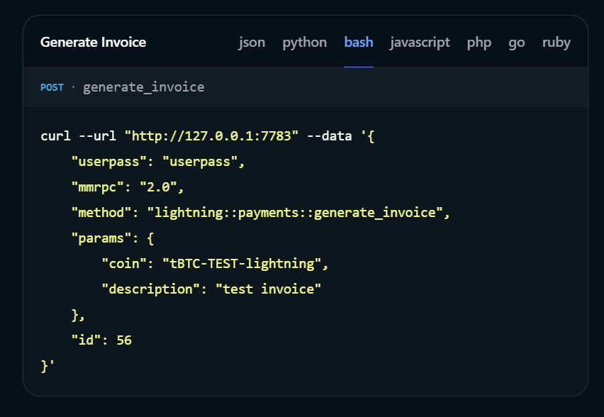
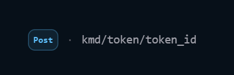
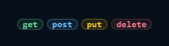
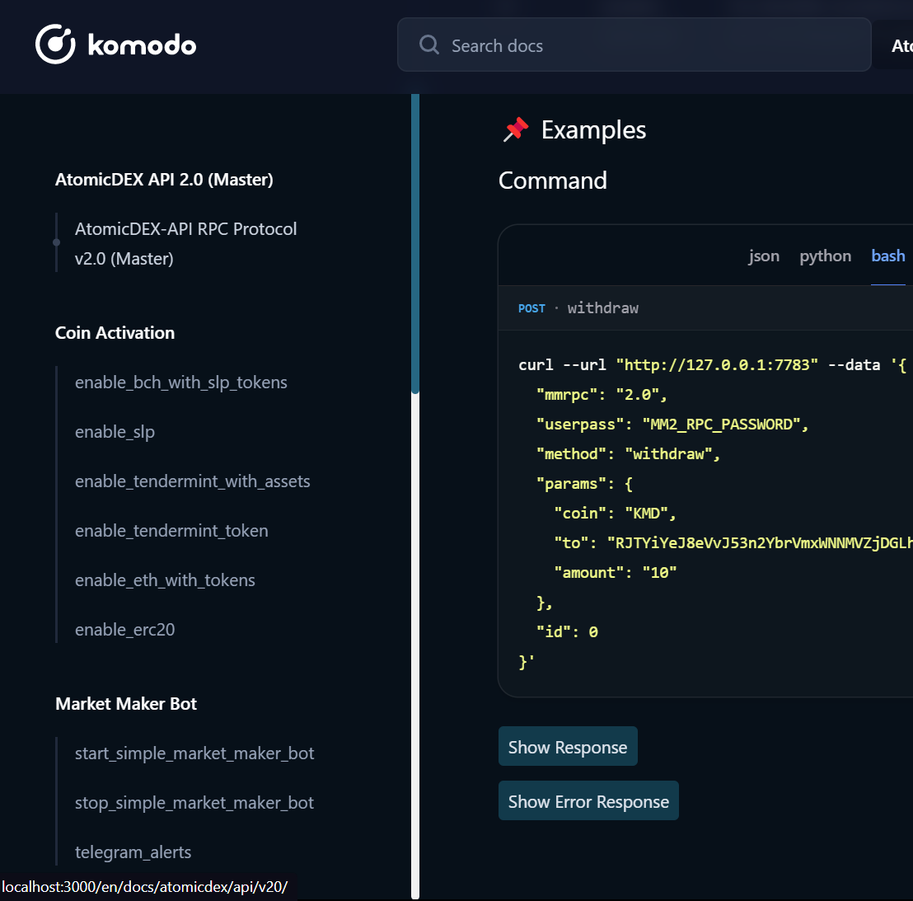

# Style Guide

<p align="center">
 <a href="https://xkcd.com/">
  
 </a>
</p>

Great documentation is critical for guiding those who will use our tech stack. It should be clear, easy to read, and as detailed as required while avoiding unnecessary verbosity. This way, developers can quickly understand how to use and what to expect from our products.

From a user's perspective:

- If they can't find information about a feature in the documentation, it means that **the feature doesn't exist**.
- If there is information about a feature, but it's wrong or confusing, it means that **the feature is broken**.
- If the documentation is hard to read, it means that **the feature is hard to use**.

Be mindful of any feedback you receive from users, and let it guide you to improve the documentation. The eyes of the uninitiated are the best tool for identifying areas in need of enhancement. Though existing documentation may not yet conform to this standard, all new documentation should be written following the guidelines below, and existing documentation updated to match when time permits.

**These guidelines are currently a work in progress.** Please also refer to https://alistapart.com/article/the-ten-essentials-for-good-api-documentation/ as a good foundation.

## Structure

- Generally, individual API methods should be placed in their own `index.mdx` file, within a folder named after the method.
  - The `index.mdx` file should contain a heading with the method name and a description of the method.
  - Each file should contain a code block with at least one example of how to make a complete request, including all required parameters.
  - Where a request includes optional parameters which will result in different response structures, the file should contain a code block for each possible request variation, followed by a code block for the response of each example.
  - Below the request/response examples, include code blocks for each potential error response, along with details on what causes the error and how it might be resolved.
- In some cases, it may be appropriate to group related methods together in a single `index.mdx` file. For example, the `index.mdx` file within the `task_init_trezor` folder contains documentation for all methods for initialisation and authentication with a Trezor hardware wallet.
- Where common structures exist in the request or response of mulitple methods, these should be documented in the `index.mdx` file in the base folder for a section (e.g. [src/pages/atomicdex/api/v20/index.mdx](src/pages/atomicdex/api/v20/index.mdx)), and linked to from request/response parameter tables where required.
- Where a method or parameter is deprecated, this should be communicated in the method heading or request parameters table.
- Separate sections of content with subheadings to make scanning and finding the information they need easier. Two line breaks should be used before and one line break after each subheading.

## General

- Use [American English spelling](https://www.thefreedictionary.com/American-English-vs-British-English-Spelling.htm)
- Use the [Oxford comma](https://www.youtube.com/watch?v=xUt7-B8IfxU)
- Use [Bluebook title case](https://titlecaseconverter.com/rules/#BB) for headings and products.
- Use [sentence case](https://titlecaseconverter.com/sentence-case/) for menu items, tabs, buttons, links, and all other text.
- Use a 4-space indent in code blocks for the request body and response. This will make the parameters and values easier to read.
- Use images or diagrams to help explain complex concepts or processes. This will make the content more engaging and easier to understand.
- If a user action requires a sequence of steps, consider using a flowchart to illustrate the process.
- Keep it concise: Stay on point. Avoid unnecessary words or phrases that do not add value to the content.
- Don't skimp on important detail: If a feature is complex, it's better to provide too much information than not enough. Where appropriate it may be better to split the additional information into its own page and add a link to it for those who want to dig deeper.
- Use simple language: Where possible, avoid jargon or technical terms that may be unfamiliar to the reader. When unavoidable, provide a link to a definition or explanation of the term.
- Proofread and test your content: Make sure to proofread your MDX file for errors and test any code snippets or examples to ensure they work as expected.
- Be generous with hyperlinks: Link to relevant documentation or resources, whether to somewhere else within our internal docs or to a respected external source. This will provide additional context and help users better understand the content.
- Use absolute links for internal docs: The `pages` folder is the root directory for internal docs. Use absolute links to reference other pages within the `pages` folder, for example: `[AtomicDEX API methods](/atomicdex/api/#sub-section-header)`. The url must end with a slash.
- Use bullet points and numbered lists to break up long paragraphs to make the content more readable.

## Syntax

- Use `#` for page headings.
- Use `##` for subheadings.
- Use `###` for request/response parameter tables.
- Use `####` for request/response examples.
- Use mdx comments like this: `{/* comment comment */}` . Markdown comments like `<!--- comment comment--->` doesn't work.
- No markdown/mdx comments in tables' rows

## Tables

- Include a reference table listing all **request** parameters, their type, a description, and whether it is required or optional.
- Include a reference table listing all **response** parameters, their type, a description, and whether it is part of the standard response or only returned when using a specific request parameter value.
- Optional parameters should be identified at the start of the parameter's description, along with the default value (if applicable).
- Optional parameters should be listed at the bottom of the parameter table

## Variables

- For AtomicDEX-API methods, the userpass variable should always be `testpsw`

## Templates

Use the linked templates below as a starting point for new documentation pages.

- [AtomicDEX API methods](templates/atomicdex_method.mdx)

## How to contribute

Read the [Contribution guide](CONTRIBUTION_GUIDE.md) first.

Pages are heavily [**MDX**](https://mdxjs.com/) ("markdown extension") based, which allows us to use JSX in markdown content. You can have imported components (JSX) within your content and more. Read more about MDX here [https://mdxjs.com/docs/what-is-mdx/](https://mdxjs.com/docs/what-is-mdx/).

### Adding a Title and Description

Titles and descriptions are mandatory on every documentation page and must be added at the top level. To add a title use this syntax: `export const title = "Documentation page title";`. To add a description use: `export const description = "documentation page description";`

### Components

We've got a few **MDX** components we use across the Docs. Below is a walkthrough of how to start writing and using the components that make up the Docs.

IMPORTANT: Alwats use double quotes inside mdx tags.

Example:

Correct:

```
<CollapsibleSection expandedText="Hide Examples" collapsedText="Show Examples">
```

Wrong:

```
<CollapsibleSection expandedText='Hide Examples' collapsedText='Show Examples'>
```

MDX supports standard markdown by default [CommonMark](https://commonmark.org/). However, this project also has [GFM](https://github.github.com/gfm/) installed.

> Many of the components mentioned here are simplified and possibly do more than **explicitly pointed out**.

### CodeGroup

The `CodeGroup` acts as a wrapper around code blocks. It allows us to have tabbed content (or not, if it's a single block) with properties such as **title, tags, labels and more**. An example would look something like this:

````mdx
<CodeGroup title="Code Sample" tag="post" label="/kmd/jwt/post" >

```ts
// ...
```

```python

// ...

```

```php

// ...

```

</CodeGroup>
````

And rendered as:


<!-- If you have a single block of code, you can use the `CodeGroup` without wrapping it around the block by using `mdx-annotations`.

````mdx
```ts {{title: "Single Block", tag: "post", label: "/kmd/jwt/post"}}
// ...
```
````

And you'll still have it rendered correctly:

 -->

It is important to **note that**, "**AtomicDEX methods**" should be wrapped with `CodeGroup` tags, using the **method name** as the **label value**, and the **tag value** set to **POST**, an additional **mm2MethodDecorate property** with the value **"true"**. This will generate code blocks for:

- **JSON**: The pure request body.
- **Python3**: Using the requests library.
- **Bash**: Using curl.
- **Javascript**: using fetch.
- **PHP**: Using curl.
- **GO**: Using net/http. (need to confirm this is correct)
- **Ruby**: Using net/http.

You only need to include the `json` data, and the additional **mm2MethodDecorate property** populates for various languages automatically.

A working code sample would look like this:

````mdx
<CodeGroup title="Generate Invoice" tag="POST" label="generate_invoice" mm2MethodDecorate="true">

```json
{
  "userpass": "testpsw",
  "mmrpc": "2.0",
  "method": "lightning::payments::generate_invoice",
  "params": {
    "coin": "tBTC-TEST-lightning",
    "description": "test invoice"
  },
  "id": 56
}
```

</CodeGroup>
````

Rendered as:



### Note

Use `Note` tags to **highlight important information**. `Note`s can be one of three states:

- **info** (Default)
- **warning**
- **error**

```mdx
<Note type="info">
  Komodo Platform is an open-source, decentralized blockchain project committed
  to privacy and security. It offers flexibility for developers with support for
  multiple programming languages and a modular architecture.
</Note>
```

```mdx
<Note type="warning">
  Komodo Platform is an open-source, decentralized blockchain project committed
  to privacy and security. It offers flexibility for developers with support for
  multiple programming languages and a modular architecture.
</Note>
```

```mdx
<Note type="error">
  Komodo Platform is an open-source, decentralized blockchain project committed
  to privacy and security. It offers flexibility for developers with support for
  multiple programming languages and a modular architecture.
</Note>
```

Rendered as:


### CollapsibleSection

This renders a button with a specified text based on its state (expanded or collapsed).

You'll mostly use this for API, Commands, etc. Responses, which should be wrapped with the `CollapsibleSection` tags, for example:

````mdx
   <CollapsibleSection expandedText='Hide Response' collapsedText='Show Response'>
      #### Response (ready, successful)

      ```json
      {
         "mmrpc": "2.0",
         "result": "success",
         "id": null
      }
      ```

   </CollapsibleSection>
````

The `CollapsibleSection` tags should also wrap all error responses (as a group), with the `expandedText` and `collapsedText` values set to '**Show Error Responses**' and '**Hide Error Responses' respectively**.

A working code would look like this:

````mdx
<CollapsibleSection expandedText='Hide code' collapsedText='Show code'>

```json
{
  "sad_story": "What did the robot say to the dead robot? Rust-in-peace",
  "category": "programming",
  "rating": 8.5,
  "source": "unknown",
  "date": "2078-05-16"
}
```

</CollapsibleSection>
````

Rendered as:


### Images

Images should be added to the related subfolder within the `src/images` folder, and rendered using the `OptimizedImage` component. To render an image in the `src/image` folder, you'd have to import the image using the following syntax:

`import atomicManiq from "@/images/atomic-dex-maniq.webp";`

Now you can render the image using the `OptimizedImage` component, for example:

`<OptimizedImage title="Atomic Dex" src={atomicManiq} alt="atomic dex" classNaming="w-full" />`


<!-- [You can read more about the magic behind OptimizedImage](https://github.com/Niels-IO/next-image-export-optimizer#readme) -->

### Heading

The `Heading` component (defaults to `h2`) functions exactly like the **native heading** tags with the exception that it takes a prop that allows us to have it labelled and tagged. It also takes an `anchor` prop (defaults to `true`) that makes it possible to link that section to another section on the page by passing it an `id` prop. If `anchor = true` and no `id` is passed, it links to itself.

To use this component, you need to have it imported: `import { Heading } from "@/components/mdx/Heading";`

Then render it:

```mdx
<Heading label="get_all_tokens" tag="API-v2" anchor={false}>
  How to get your tokens
</Heading>
```

To save time, you can use the `Heading` component without importing it. And this can be done by using the native **heading tag** but **with annotations** matching the props you'd otherwise pass to the `Heading` component. Depending on the `props`, this renders the same output in the browser.

Here's how:

```mdx
## How to get your tokens {{label : 'get_all_tokens', tag : 'API-v2'}}
```

Rendered as:


### TaggedSection

`TaggedSection`s are used to **tag && label** a section. Just like the `Heading` component. The heading component uses the `TaggedSection` component under the hood.

To use this component, you need to have it imported: `import { TaggedSection } from "@/components/mdx/Heading";`

However, it is often used for tagging/labelling headings (`h2 || h1`). If you happen to find a use for it in a non-heading section, feel free to use it.

Here's how to use it:

```mdx
<TaggedSection tag={"Post"} label={"kmd/token/token_id"} />
```

Rendered as:



### Tag

`Tag`s are used for tagging a `CRUD` operation. To use it, import it with the syntax `import { Tag } from "@/components/mdx/Tag";`.
This component takes 4 types of children as follows

- C - **post**
- R - **get**
- U - **put**
- D - **delete**

A working code would look like this:

```
<Tag>post</Tag>
<Tag>get</Tag>
<Tag>put</Tag>
<Tag>delete</Tag>
```

Rendered as:



## Sidebar (Left)

Sidebar navigation is manually populated. This file can be found at `src/data/sidebar.json`. If you're working on a new page, this is where to link them.



## Sidebar (Right)


The right sidebar is automatically populated based on the **Heading hierarchy** of the current page.

## Conclusion

As much as we can, we try to make every file as readable as possible, so you won't be needing help figuring out **how to do/use {A || B}**.
We encourage you to do the same when you're contributing and you just might get a medal of binary from the community.

Thats it! You've completed the KMD-Docs contribution boot camp!

Have fun!
